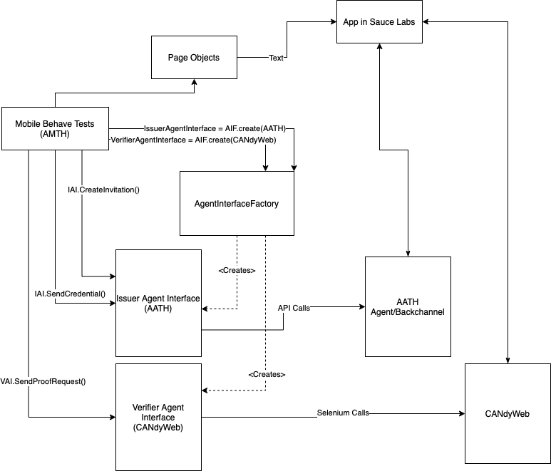
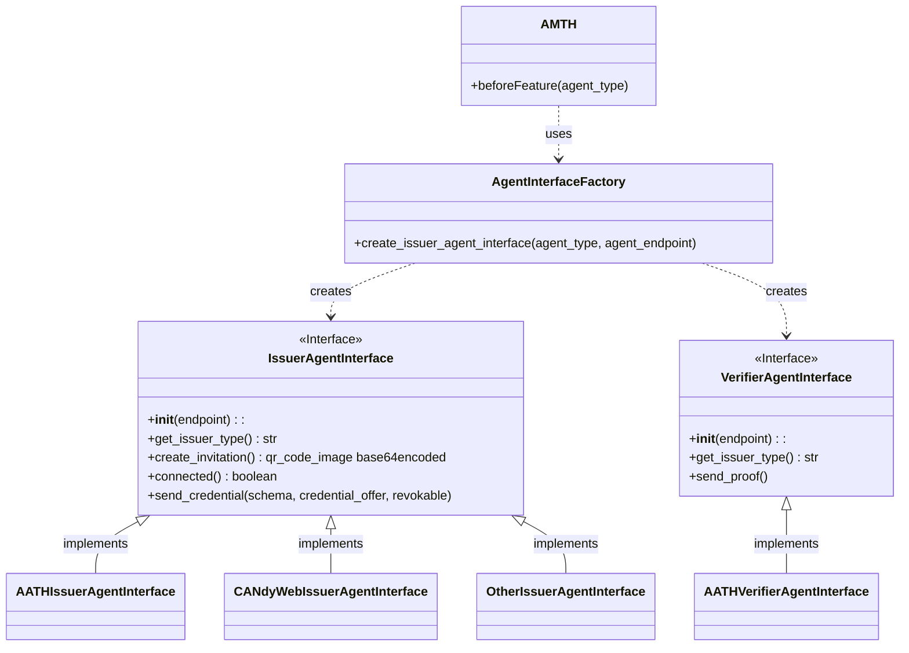

# AGENT ABSTRACTION Any Agent Same Test<!-- omit in toc -->
[](LICENSE)
  
## Contents<!-- omit in toc -->

- [The Problem](#the-problem)
- [The Solution](#the-solution)
- [Usage at Runtime](#usage-at-runtime)
- [Implementing Tests That Can be Used Across Agents](#implementing-tests-that-can-be-used-across-agents)
- [Implementing Agent Interfaces for Your Agents](#implementing-agent-interfaces-for-your-agents)
- [Test Data Management for Varying Agents Credentials](#test-data-management-for-varying-agent-credentials)

## The Problem
In writing wallet tests we have to consider the issuer and the verifier in end to end tests. Tests not only have to manipulate the wallet app but also has to make calls to issuers for making connections and sending credentials, as well as make calls to verifiers for proofs. These calls are usually done through REST API calls directly to the agent controller, and usually done directly from the tests. This however locks the tests to specific issuers and verifiers. This isn't really real world as most wallets will be able to accept credentials from multiple issuers and a wide range of verifiers for proofs. To test new issuers and verifiers we would have to create new test code and new test scenarios to incorporate the new agents in those roles. 

This isn't the case with Aries Mobile Test Harness
  

## The Solution
Using a variation on a Factory Pattern, AMTH tests can utilize any issuer or verifier as long as the issuer or verifier interface is implemented. This creates an Agent Abstraction layer providing tests the freedom from agent controller implementations.

The following diagram provides a rough overview of the architecture of the Agent Abstraction layer .


### Class Diagram

The Agent Interface factory, is called upfront at the beginning of a test run to create an instance of the interface for the issuer and verifier passed in on the command line with the `-i` and `-v` parameters on the AMTH `manage run` command.  The type of agent you wish each use for these roles are prefixed to the value for those parameters. For example, if the issuer is going to be an Aries Agent Test Harness backchannel/agent the parameter would look like this, `-i AATH;http://0.0.0.0:9020`.  The type and endpoint to the issuer is separated by a semi-colon. Note that all agents are external to AMTH and must be running before running the `manage run` command. 

These Agent Interfaces implement their common methods based on the interface defined in the `IssuerAgentInterface` and `VerifierAgentInterface` Abstract Base Classes.

Once the Factory creates instances of these Agent Interfaces, they are then used throughout the tests to do common calls to the issuers and verifiers, like `create_invitiation` or `send_credential`. 

The interfaces have a default credential data so that if no parameters are giving to these interface functions it uses a default and all data for that default is managed in the interface. There is a way to do custom credential data or custom proofs and still use the same tests and test code, but we will talk about that in Test Data Management below. 

At the time of writing this document an interface has been created for aries-agent-test-harness backchannels/agents. These AATH agents can play either issuer or verifier or both. Just this simple interface implementation allows AMTH tests to access all of the aries agent frameworks that have implemented backchannels in AATH. So any wallet tested in the AMTH framework can be tested with ACA-py, Aries Framework .Net, Aries VCX, Aries Framework GO, Aries Framework Javascript, among others acting as issuers and/or verifiers.  

## Usage at Runtime
As mentioned above the agent types are passed in to the manage script with `-i` and `-v` parameters. So given we have AATH backchannel/agent interfaces created we can run the following commands to run tests against a wallet (like BC Wallet in this case) with any AATH agent. 
This example will run ACA-py and AFGO from AATH, and use ACA-py as an issuer and AFGO as the verifier in the AMTH mobile tests. 
Clone AATH and build and run the agents needed
```
git clone https://github.com/hyperledger/aries-agent-test-harness
cd aries-agent-test-harness
./manage build -a acapy-main -a agfo-master
LEDGER_URL_CONFIG=http://test.bcovrin.vonx.io TAILS_SERVER_URL_CONFIG=https://tails.vonx.io AGENT_CONFIG_FILE=/aries-backchannels/acapy/auto_issuer_config.yaml ./manage start -a acapy-main -b afgo-master -n
```
The run command above will start two agents ACA-py as Acme and AFGO as Bob. These names are well known to users of AATH, but they really don't matter in the context of AMTH and either of these agents can play the issuer or verifier role in AMTH. 
A custom set of startup parameters are passed in to be used by ACA-py through the AGENT_CONFIG_FILE environment variable. This starts ACA-py with the appropriate auto options to be able to work with a mobile app with minimal controller calls. 

Build and run Mobile tests for the BC Wallet
```
git clone https://github.com/hyperledger/aries-mobile-test-harness
cd aries-mobile-test-harness
./manage build -w bc_wallet
LEDGER_URL_CONFIG=http://test.bcovrin.vonx.io REGION=us-west-1 ./manage run -d SauceLabs -u <sauce labs username> -k <sauce labs key> -p iOS -a AriesBifold-125.ipa -i "AATH;http://0.0.0.0:9020" -v "AATH;http://0.0.0.0:9030" -t @bc_wallet -t ~@wip
```
The AMTH command above will use the AATH agent interface for both issuer and verifier, the issuer endpoint point to ACA-py(running as ACME in AATH) and the verifier endpoint points to AFGO(running as Bob in AATH).
It will run the BC wallet in Sauce Labs on iOS and run all bc_wallet tests that are not Work in Progress (@wip)

##  Implementing Tests That Can be Used Across Agents
Implementing tests that use the default credentials and should be easy as long as the agent interfaces are implemented following the guidelines of managing default data internally. The following is an example of a test that works with the BC wallet using a default credential. 
```gherkin
@CredentialOffer  @bc_wallet
Feature: Issuer Offers a Credential

@T001-CredentialOffer  @critical  @AcceptanceTest
Scenario: Holder receives and views the contents of a credential offer
Given the User has completed on-boarding
And the User has accepted the Terms and Conditions
And a PIN has been set up with "369369"
And a connection has been successfully made
When the Holder receives a Non-Revocable credential offer
And the Holder taps on the credential offer notification
Then holder is brought to the credential offer
And they can view the contents of the credential
| issuer_agent_type | who | cred_type | attributes | values |
| AATHIssuer | aca-py.Acme | Test Schema. | Attr 1;Attr 2;Attr 3 | value_1;value_2;value_3 |
```
The key step definitions here that we will focus on are the ones that will call the issuer. These are
`And a connection has been successfully made`
which has the important sub-step of 
`When the Holder scans the QR code sent by the issuer`
and
`When the Holder receives a Non-Revocable credential offer`

In the these two steps there are simple calls to the issuer agent interface that will be common to all agents that implement the interface. 

```python
@when('the Holder scans the QR code sent by the issuer')
def  step_impl(context):
	qrimage = context.issuer.create_invitation()
	context.thisHomePage.inject_connection_invite_qr_code(qrimage)
	context.thisConnectingPage = context.thisHomePage.select_scan()
```

```python
@when('the Holder receives a Non-Revocable credential offer')
def  step_impl(context):
	context.issuer.send_credential()
```

The instantiated issuer and verifier interfaces will always be added to the Behave context object, so you will always get a handle on those objects by referencing `context.issuer` and `context.verfier`
`create_invitation()` `and send_credential()` are given no parameters indicating to use the defaults inside the implemented interface. 

Now notice that in the test specification the last step contains a data table with data. Up to this point the test scenario had no need to know the default credential information, but at this point the test has to take control and verify that the holder has the credential in question in order to pass the test. We have to tell the test what values to assert for the credential details. So how does this work if I switch the issuer to another implemented interface with a different default credential? No test code needs to change or written, all you need is to add an extra line to the same test in the data table. So lets say there is an interface implemented for a CANdy Issuer (there isn't yet) named CANdyWeb, and we want to use that credential to test the BC wallet with. You would add the following to the data table. 

```gherkin
@CredentialOffer  @bc_wallet
Feature: Issuer Offers a Credential

@T001-CredentialOffer  @critical  @AcceptanceTest
Scenario: Holder receives and views the contents of a credential offer
.
.
And they can view the contents of the credential
| issuer_agent_type | who | cred_type | attributes | values |
| AATHIssuer | aca-py.Acme | Test Schema. | Attr 1;Attr 2;Attr 3 | value_1;value_2;value_3 |
| CANdyWebIssuer | # CANdy - Unverified Person Issuer | Unverified Person | First Name;Last Name;Date of Birth;Street Address;Postal Code;City;Province;Country;Issued | Sheldon;Regular;1989-03-04;123 Perfect Street;A2V 3E1;Awesome City;BC;Canada;2022-03-14T23:27:20.133Z |
```

This test above can now be executed against a AATH Issuer agent or a CANdy Issuer agent and will not fail. 

That last step is implemented as follows, (TODO: put in permalink on GitHub)
```python
@then('they can view the contents of the credential')
def step_impl(context):
    assert context.thisCredentialOfferPage.on_this_page()
    who, cred_type, attributes, values = get_expected_credential_detail(context)
    actual_who, actual_cred_type, actual_attributes, actual_values = context.thisCredentialOfferPage.get_credential_details()
    assert who in actual_who
    assert cred_type in actual_cred_type
    assert attributes in actual_attributes
    assert values in actual_values

def get_expected_credential_detail(context):
    issuer_type_in_use = context.issuer.get_issuer_type()
    found = False
    for row in context.table:
        if row["issuer_agent_type"] == issuer_type_in_use:
            who = row["who"]
            cred_type = row["cred_type"]
            attributes = row["attributes"].split(';')
            values = row["values"].split(';')
            found = True
            # get out of loop at the first found row. Can't see a reason for multiple rows of the same agent type
            break
    if found == False:
        raise Exception(
            f"No credential details in table data for {issuer_type_in_use}"
        )
    return who, cred_type, attributes, values
```
Notice the `context.issuer` calls the `get_issuer_type()` method that must be implemented in the interface. This tells the tests which set of data in the test to verify the credential against. 

## Implementing Agent Interfaces for Your Agents
To implement a new issuer or verifier agent interface you must inherit and implement the [IssuerAgentInterface](add link here when merged) and the [VerifierAgentInterface](add link here when merged. 
Follow the convention setup by the [AATHIssuerAgentInterface]() and [AATHVerfierAgentInterface]()

Keep in mind, not only can you implement agent interface that can call APIs to accomplish these goals, but if the issuer or verifier is just a web interface you can use selenium to drive the create of invitations, send credentials, etc. 

## Test Data Management for Varying Agents Credentials
What if we want to have different sets of credential data than what is provided by the Agent Interface by default? We follow the same pattern as the test data table above only use it for creating the credential or contracting a proof. More details to follow here when a test like that is implemented. Data may point to json files defining the data as does AATH. 
```gherkin
When the issuer send the credential
| issuer_agent_type |  | credential_data |
| AATHIssuer | | Data_DL_MaxValues | 