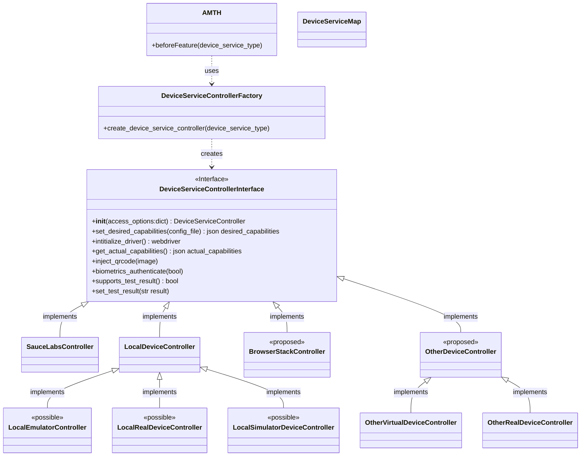

# MOBILE DEVICE SERVICES<!-- omit in toc -->

  
## Contents<!-- omit in toc -->

### Class Diagram

```mermaid
classDiagram
   DeviceServiceControllerInterface <|-- SauceLabsController :implements
   DeviceServiceControllerInterface <|-- LocalDeviceController :implements
   LocalDeviceController <|-- LocalEmulatorController :implements
   LocalDeviceController <|-- LocalRealDeviceController :implements
   LocalDeviceController <|-- LocalSimulatorDeviceController :implements
   DeviceServiceControllerInterface <|-- BrowserStackController :implements
   <<proposed>> BrowserStackController
   DeviceServiceControllerInterface <|-- OtherDeviceController :implements
   OtherDeviceController <|-- OtherVirtualDeviceController :implements
   OtherDeviceController <|-- OtherRealDeviceController :implements
   <<proposed>> BrowserStackController
   <<proposed>> OtherDeviceController
   <<possible>> LocalEmulatorController
   <<possible>> LocalSimulatorDeviceController
   <<possible>> LocalRealDeviceController
   DeviceServiceControllerFactory ..> DeviceServiceControllerInterface :creates
   <<Interface>> DeviceServiceControllerInterface
  
   AMTH ..> DeviceServiceControllerFactory :uses

   class DeviceServiceControllerFactory{
       +create_device_service_controller(device_service_type)
   }
   class DeviceServiceControllerInterface{
       +__init__(access_options:dict)DeviceServiceController
       +set_desired_capabilities(config_file)json desired_capabilities
       +intitialize_driver()webdriver
       +get_actual_capabilities()json actual_capabilities
       +inject_qrcode(image)
       +biometrics_authenticate(bool)
       +supports_test_result()bool
       +set_test_result(str result)
   }
   class DeviceServiceMap{
     
   }
    class AMTH{
      +beforeFeature(device_service_type)
    }		
```
