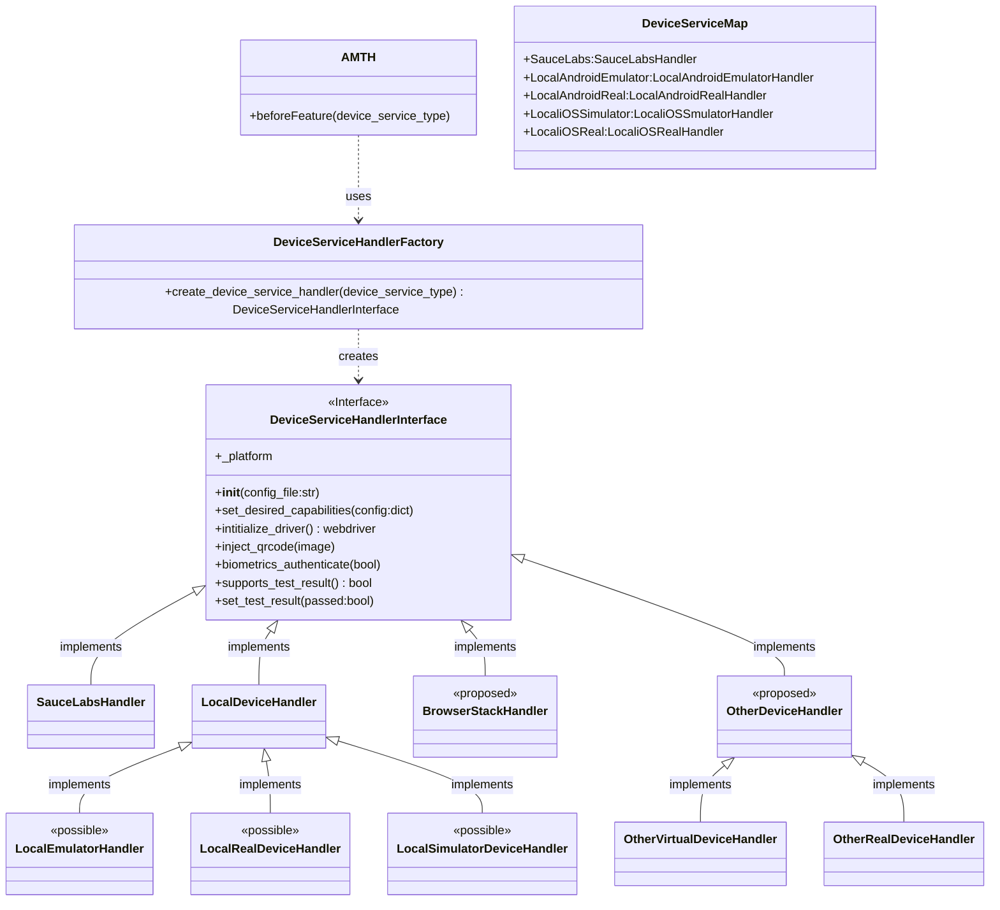

# MOBILE DEVICE SERVICES (Local & Cloud)<!-- omit in toc -->

[](LICENSE)

## Contents<!-- omit in toc -->

### Summary

There are many devices and device services we wish to support with the Aries Mobile Test Harness. They would not only include cloud services like Sauce Labs and BrowserStack, but also local devices like connected real iOS and Android devices, or Emulators and Simulators running on the local machine or in a container. All of these services have differing ways to do certain actions, like image injection for QR Code scanning, or biometrics handling, or just the way the capabilities are setup are different between them. Running with a local device allows test development and exection without having to pay for and maintain a cloud based device service like Sauce Labs, but will not give you streamlined pipeline exection across varying devices and platforms that services like Sauce Labs provide.

To simplify the complexity of supporting these device services for a given set of tests, a Device Service Handler interface and factory has been created to obfuscate the specific implementations of these differences from them tests and supporting page objects.

### Design



### Usage of the Handlers in Tests

Using the device handlers in the test code will be the same no matter which device handler is being used. The handler is assigned to the test run based on the `-d` option on the `./manage run` command of AMTH. This means the same test code can be used for the run command,

```
LEDGER_URL_CONFIG=http://test.bcovrin.vonx.io REGION=us-west-1 ./manage run -d SauceLabs -u <sl user name> -k <sl access key> -p Android -a app-release.aab -i "AATH;http://0.0.0.0:9020" -v "AATH;http://0.0.0.0:9030" -t @T002.1-Proof
```

can be the same as the test code used for this run command,

```
LEDGER_URL_CONFIG=http://test.bcovrin.vonx.io ./manage run -d LocalAndroid -p Android -a /<full local path>/AriesBifold-209.apk -i "AATH;http://0.0.0.0:9020" -v "AATH;http://0.0.0.0:9030" -t @bc_wallet -t @T002.1-Proof
```

The test harness creates an instance of the handler at the start of the test run, and adds it to the Behave `context` object that gets passed around to all the tests. So to call specific functions on the device handler, user the `context.device_service_handler` instance to do so.

The two biggest differences between handlers are biometrics handling and QR code (image) injection. To call any of these functions at the point it is needed in the test code, it is called as follows,

```python
context.device_service_handler.biometrics_authenticate(True)
```

and

```python
context.device_service_handler.inject_qrcode(image)
```

## Setup

The setup required will be different depending on the device service being used.

### Setup with Sauce Labs

The user will need a Sauce labs account. If testing includes QR Code scanning, this account will need to be the real device service as it is the only one in Sauce Labs that supports image injection.

If running the test harness locally with AATH agents acting as issuer and/or verifier when doing test development the Sauce Connect Tunnel will be needed to allow communication with the local agents.

```bash
docker pull saucelabs/sauce-connect
```

```bash
docker run --rm \
    -e SAUCE_USERNAME=<sl user name> \
    -e SAUCE_ACCESS_KEY=<sl access key> \
    --network="host" \
    -it saucelabs/sauce-connect \
    --user <sl user name> --api-key <sl access key>
    --direct-domains <aries-mediator-agent-test-endpoint>
```

If the wallet under test is using a Mediator agent, there will be a need to add the endpoint to the `--direct-domains` option so that the wallet won't go through the Sauce tunnel to connect to the mediator. That is, unless the mediator is running on your local machine or behind a corporate firewall.

### Setup with an Local Android Emulator

- Install Android Studio for your platform
- Open Android Studio and open/create a new project
- Open Device Manager under Tools menu
- Create a device or launch an existing emulator
- Install Appium Server
- Start Appium Server
- In AMTH, update the local_android_config.json with the appropriate settings. For Example, here is a set of capabilities that work with the BC Wallet app.

```json
{
  "capabilities": {
    "appPackage": "ca.bc.gov.BCWallet",
    "appium:appActivity": "ca.bc.gov.BCWallet.MainActivity",
    "platformName": "Android",
    "app": "/Users/Shel/Projects/BC.gov/apps/bifold-bc/AriesBifold-209.apk",
    "deviceName": "Android Accelerated Oreo",
    "udid": "emulator-5554",
    "automationName": "UiAutomator2",
    "autoGrantPermissions": true
  }
}
```

- If you need to retrieve the app package and activity from an Android APK file, follow these steps:

  Install the Android SDK on your computer.
  Locate the aapt tool within the build-tools directory of your Android SDK installation.
  Use the aapt command in Terminal or Command Prompt as follows:

  ```bash
    /path/to/aapt dump badging /path/to/your/app.apk
  ```

  Replace `/path/to/aapt` with the actual path to the aapt tool and `/path/to/your/app.apk` with the path to your APK file.
  Look for the lines starting with package: and launchable-activity: in the output.
  The app package is the value after name= in the package: line, and the app activity is the value after name= in the launchable-activity: line.

  By following these steps, you can easily extract the app package and activity from any Android APK file, which can be useful for app testing and development purposes.`

- Setup biometrics correctly on the emulator
  <br>Important Note: Bifold is currently not supported on iOS simulators, which means wallets built on Bifold will not work on an iOS emulator. For more information, visit the Hyperledger Aries Mobile Agent React Native repository.

  To set up biometrics on an Android emulator, you need to use adb commands instead of the Extended Tool window of the emulator's UI. Follow these steps to configure biometrics:

  Set up and run the Android emulator.
  Navigate to Settings > Security > Device Security.
  Select one of the fingerprint setup options.
  Proceed to the "Unlock with Fingerprint" or a similar screen.
  Wait for the "Touch the Sensor" screen to appear.
  Use the following adb command to enter a fingerprint, replacing <emulator_name> with your emulator's name and <int> with an integer value representing the fingerprint ID:

  ```bash
  adb -s <emulator_name> emu finger touch <int>
  adb -s emulator-5554 emu finger touch 1

  ```

  You can use this fingerprint id in your tests to authenticate biometrics

- Set ANDROID_HOME environment variable to the android sdk. For example:

```bash
export ANDROID_HOME=/Users/Shel/Library/Developer/Xamarin/android-sdk-macosx
# system wide do something like this
echo 'export ANDROID_HOME=/Users/Shel/Library/Developer/Xamarin/android-sdk-macosx' >> ~/.zshenv
```

- Edit ${ANDROID_HOME}/emulator/resources/Toren1BD.posters, and add:

```
poster custom
size 1.2 1.2
position 0 -0.1 -1.8
rotation 0.1 0 0
default qrcode.png
```

- You must have the Android emulator PIN security setup in order to do biometrics, do not turn off the PIN, but when you start the emulator, unlock it with the pin before running tests.
- You must (for now) set the `save_qr_code_on_creation` AMTH option in the `behave.ini` file to `True`

At this point, if a set of tests exist for the wallet under test, the ./manage run command will work with your local Android Emulator. For example, this command will successfully run tests for the BC Wallet, if AATH agents are running.

```
LEDGER_URL_CONFIG=http://test.bcovrin.vonx.io ./manage run -d LocalAndroid -p Android -a /<full local path>/AriesBifold-209.apk -i "AATH;http://0.0.0.0:9020" -v "AATH;http://0.0.0.0:9030" -t @bc_wallet -t @T009-Proof
```

### Setup with a Real Andoid Device Connected Locally

TBD

### Setup with a Local iOS Simulator

TBD

### Setup with a Real iOS Device Connected Locally

TBD

### Debugging with VS Code

Most of the time for test development, the test developer will want to be running with a Local Device with the Python IDE of choice. The following is an example of getting AMTH running with a Local Device and using VS Code as the IDE.

#### Setup AMTH locally

Setting up AMTH locally means running the test harness without the provisioning and handling of the `manage` script, and running the test harness outside of its containerized version. To setup locally, installation of the libraries and components that comprise the AMTH.

If not already installed, install Python 3.7 on your local environment.

Then `pip install` the following libraries.

```
behave
allure-behave
SauceClient
paver==1.3.4
selenium
psutil==5.7.2
Appium-Python-Client
qrcode[pil]~=6.1
webdriver-manager
python-decouple
aiohttp
```

#### Setup VS Code

Create a launch.json file for your instance of VS Code. See [here](https://code.visualstudio.com/docs/editor/debugging) for more details.

Open the launch.json file created for debugging and add the following section to it.

```
        {
            "name": "Python: Behave current file",
            "type": "python",
            "request": "launch",
            "module": "behave",
            "console": "integratedTerminal",
            "cwd": "${workspaceFolder}/aries-mobile-tests",
            "env": {
                "SAUCE_USERNAME": <sauce username>,
                "SAUCE_ACCESS_KEY": <sauce access key>,
                "SL_REGION": "us-west-1",
                "DEVICE_CLOUD": "LocalAndroid"
            },
            "args": [
                "${file}",
                "--tags=@T002-Proof",
                "-k",
                "-D",
                "Issuer=AATH;http://0.0.0.0:9020",
                "-D",
                "Verifier=AATH;http://0.0.0.0:9030"
            ]
        },
```

This configuration sets up expected environment variables, launches behave directly and sends in expected behave arguments.

The key environment variable here is the `DEVICE_CLOUD`, setting it to `LocalAndroid` tells the test harness to use a local android emulator. the SAUCE\* environment variables can be removed/ignored here, but they could be used here to do test debugging with Sauce Labs Devices instead of a local device.

The `args` are behave arguments as the `manage` script would pass to behave. Setup the tags that point to the tests you want to run, and set the issuer and verifier to your preferred services.

With this setup you will need to have the feature file of the test(s) you wish to run in view when you select debug.

#### Working with a Local Device

The last step in getting the local device working with VS Code is to edit the AMTH config.json file, setting the capabilities to the appropriate settings. For example, this configuration works with the BC Wallet with a local running Android emulator.

```
{
  "capabilities": {
    "appPackage": "ca.bc.gov.BCWallet",
    "appium:appActivity": "ca.bc.gov.BCWallet.MainActivity",
    "platformName": "Android",
    "app": "/Users/Shel/Projects/BC.gov/apps/bifold-bc/AriesBifold-209.apk",
    "deviceName": "Android Accelerated Oreo",
    "udid": "emulator-5554",
    "automationName": "UiAutomator2",
    "autoGrantPermissions": true
  }
}
```

If using tests to scan a QR code, set the `autoGrantPermissions` to `true`, this will accept the devices prompt to allow camera access for the app.

### Creating a New Handler for a Device Service

To create a new handler for another cloud device service like BrowserStack, AWS, etc, or a new local device handler for iOS (which is currently not implemeted), follow the patterns laid out by the `local_android_handler.py` and `sauce_labs_handler.py` in `device_service_handler`. In short it requries the implementation of the `device_service_handler_interface` as documented in the class diagram above.

### CONFIG_FILE_OVERRIDE for bypassing default cababilities

TBD
