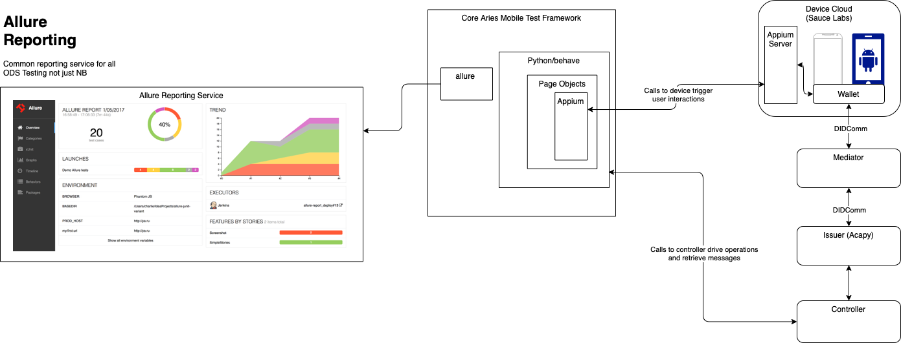

# Aries Mobile Test Harness<!-- omit in toc -->

[](LICENSE)

The Aries Mobile Test Harness (AMTH) is a [ATDD](https://en.wikipedia.org/wiki/Acceptance_test–driven_development)-based test execution engine and set of tests for evaluating Aries Mobile Wallet/Agent Apps on both Android and iOS. The harness can be used to develop a set of tests that can trigger app events as well as get screen results from the wallet apps running in a device cloud service. It also can call Aries Issuer or Verifier controllers that can be used to round out end to end tests for a full solution that includes Wallets(Holders), Issuers, and Verifiers.

The framework consists of Python, [Behave](https://behave.readthedocs.io/en/stable/), [Appium](https://appium.io), [Sauce Labs](https://saucelabs.com), and [Allure](https://github.com/allure-framework) Reporting. It borrows concepts from Acceptance Test Driven Development methodologies to write and execute tests, it also utilizes a [Page Object Pattern/Model](https://www.selenium.dev/documentation/test_practices/encouraged/page_object_models/) to isolate tests from app UI changes.

Note: If your wallet is an open source wallet, you can get free access to Sauce Labs to test the wallet. However, the Open Source tier in Sauce Labs does not support real devices or image injection(QR Code Scanning), which most if not all wallets will need.

Want to see the Aries Mobile Test Harness in action? Give it a try using a git, docker and bash enabled system. Once you are in a bash shell, run the following commands to execute a set of sample tests. INCOMPLETE

```bash
git clone https://github.com/hyperledger/aries-mobile-test-harness
cd aries-mobile-test-harness
```

Upload an app to SauceLabs

```bash
./upload_app_to_SL.sh <device_cloud_username> <device_cloud_access_key> /<full path to app>/apps/bifold-bc/app-release.apk "Android Bifold BC App" api.us-west-1
```

Upload an app to LambdaTest

```bash
./upload_app_to_LT.sh <device_cloud_username> <device_cloud_access_key> /<full path to app>/apps/bifold-bc/app-release.apk
```

Build and run the tests

```bash
./manage build -w bc_wallet

# With SauceLabs
LEDGER_URL_CONFIG=http://test.bcovrin.vonx.io REGION=us-west-1 ./manage run -d SauceLabs -u <device_cloud_username> -k <device_cloud_access_key> -p Android -a app-release.apk -i "AATH;http://0.0.0.0:9020" -v "AATH;http://0.0.0.0:9030" -t @bc_wallet -t @T002.1-Proof

# With LambdaTest
LEDGER_URL_CONFIG=http://test.bcovrin.vonx.io ./manage run -d LambdaTest -u <device_cloud_username> -k <device_cloud_access_key> -p Android -a lt://app_url_here -b BuildNameHere -i "AATH;http://0.0.0.0:9020" -v "AATH;http://0.0.0.0:9030" -t @bc_wallet -t @T002.1-Proof
```

## Contents<!-- omit in toc -->

- [Architecture](#architecture)

- [Aries Mobile Test Harness Terminology](#aries-agent-test-harness-terminology)

- [Test Script Guidelines](#test-script-guidelines)

- [Implementing Tests for Your Wallet](#aries-agent-backchannels)

- [Writting Page Objects for your Wallet](#implemented-backchannels)

- [The `manage` bash script](#the-manage-bash-script)

- [Test Tags](#test-tags)

- [Running Tagged Tests](#running-tagged-tests)

- [Test Coverage](#test-coverage)

- [Test Reporting](#test-reporting)

## Architecture

The following diagram provides an overview of the architecture of the AMTH.



## Aries Mobile Test Harness Terminology

TODO

## Test Script Guidelines

AMTH test scripts are written in the [Gherkin](https://behave.readthedocs.io/en/latest/gherkin.html#gherkin-feature-testing-language) language, using the python [behave](https://behave.readthedocs.io/en/latest/) framework. Guidelines for writing test scripts are located [here]()(TODO).

## Implementing Tests for Your Wallet

When implementing tests, the first step is to create a feature file. This feature file should located in a separate wallet folder inside the features folder. For example, `aries-mobile-test-harness/aries-mobile-tests/features/bc_wallet/connect.feature`

The corresponding steps file for the feature should be put in `aries-mobile-test-harness/aries-mobile-tests/features/steps/bc_wallet/connect.py`

Step files should always call page objects to manipulate the app. Steps should never make appium calls directly. Make this the soul purpose of the page objects. Page objects should be located in their own folder for the specific wallet. For example, `aries-mobile-test-harness/aries-mobile-tests/page_objects/bc_wallet/connecting.py`

If you use and specific external test data for your wallet testing, they should be located in `aries-mobile-test-harness/aries-mobile-tests/features/data/bc_wallet/`. If you are working directly in the AMTH repo for your wallet tests, and you have test data files that can be used across wallets, you should put that test data in `aries-mobile-test-harness/aries-mobile-tests/features/data/`. Click through for more information on [externalizing your credential and proof test data](https://github.com/hyperledger/aries-mobile-test-harness/blob/main/EXTERNALIZED_TEST_DATA.md).

On the `build` command only feature files, page_objects, and data within the corresponding wallet named folders are copied into the test harness container. The wallet steps in the `/steps/<mywallet>/` folder are imported into an all_steps.py file so Behave will only see the step implementations in that file for your wallet.

### Deciding Where to Store a Wallets Tests and Page Objects

#### Option 1: House the wallet tests in the AMTH repo

If you have an open source wallet and would like to contribute and help others with your tests as examples, please feel free to store your tests and page objects in the [AMTH Repo](https://github.com/hyperledger/aries-mobile-test-harness).

#### Option 2: Tell the AMTH where to get your tests

If you do not wish to house your tests and page objects in the AMTH repo and would prefer to store theses in your own repo. You can add a requirement.txt file in a <wallet> folder in the page objects and test folders that contains something like, `mywallet-tests@git+https://github.com/myorg/mywallet-tests.git@main`
When using the test harness from the AMTH repo, a `-w <mywallet>` option in the `.manage build` command  
TODO: The manage script needs to be updated to support this option when someone desires it.
Another way to accomplish this is to actually make your repo a [submodule](https://gist.github.com/gitaarik/8735255) of the AMTH repo. This way, one can use git commands to get the test repo and the AMTH repo together, but still live in different repos.

#### Option 3: Pull the AMTH into your environment

If you have a private repo that holds your tests and page objects for your aries wallet, you can pull the AMTH from its repo to your environment or CI workflow. One way to do this is have a requirements.txt file somewhere in your repo containing `aries-mobile-test-harness@git+https://github.com/hyperledger/aries-mobile-test-harness.git@main`, and gets used by tools in your repo to get the AMTH. Then copy your page objects and tests into the pulled test harness into a wallet folder for page objects and tests. Then build the test containers as stated at the beginning of the document with the `-w <mywallet>` option.
Another way to accomplish this is to actually make the AMTH repo a [submodule](https://gist.github.com/gitaarik/8735255) of your private repo. This way, one can use git commands to get the test repo and the AMTH repo together, but still live in different repos.

### Writting Page Objects for your Wallet

Use the [page object model](https://www.selenium.dev/documentation/test_practices/encouraged/page_object_models/) to isolate app page changes from the test code. All appium calls to get and manipulate app elements should be in page objects, not the tests. Your page objects should live in the `aries-mobile-test-harness/aries-mobile-tests/pageobjects/<mywallet>/` folder. Your page objects may inherit from the `aries-mobile-test-harness/aries-mobile-tests/pageobjects/basepage.py` class. Follow the patterns laid out in the bifold wallet page objects in the AMTH repo.

## The `manage` bash script

The AMTH `./manage` script in the repo root folder is used to manage running builds of images and initiate test runs. Running the script with no arguments or just `help` to see the script's usage information. The following summarizes the key concepts.

`./manage` is a bash script, so you must be in a bash compatible shell to run the AMTH. You must also have an operational docker installation and git installed. As well, the current AMTH requires access to a running Indy network. You can also pass in environment variables for the LEDGER_URL, GENESIS_URL or GENESIS_FILE to use a remote network. For example `LEDGER_URL_CONFIG=http://test.bcovrin.vonx.io`

Before running tests, must build the test harness docker image.`./manage build -w <walletname>`
You can build an Aca-py Issuer, Verifier. Use `./manage build -w <walletname> -i <issuer> -v <verifier>` to build the docker images the agents. Currently only `acapy-main` is supported for both issuer and verifier. Note these agents do not have a controller, you would be communicating with their admin APIs. Your tests become the controller handling web hooks, etc. If you are testing your wallet with other agents as the issuer and verifier, see the `./manage run` command below on how to pass a URL to point to your issuer or verifier controller/agent.

To run the tests, use the `./manage run...` sub-command. The `run` command requires defining what agents will be used for issuer `-i` and verifier `-v`. To review the the other options for the run command use the `./manage help` command. Essentially these other options are used to contstruct a test config for appium to tell the device cloud what platforms, devices, and operating systems to use on the devices.

The `-i issuer` and `-v verifier` in the `run` command can also take a URL to your controller/agent. One recommendation is to use [Aries Agent Test Harness agents](https://github.com/hyperledger/aries-agent-test-harness/#using-aath-agents-as-services) and backchannel controllers to speed up mobile wallet test development. When you point to external agents you must specify the type of agent interface to use in the test harness. An interface for AATH exists in AMTH, so to use AATH controllers/agents you need to specify the issuer (-i) or verifier (-v) as follows `-i "AATH;url"`. See [Any-Agent Support(Agent Abstraction)](https://github.com/hyperledger/aries-mobile-test-harness/blob/main/AGENT_ABSTRACTION.md) for details on adding support for other issuers or verifiers.

An example of a fully composed run command that tests a BC Bifold Android app that is located in the Sauce Labs device cloud is as follows;

```bash
LEDGER_URL_CONFIG=http://test.bcovrin.vonx.io REGION=us-west-1 ./manage run -d SauceLabs -u <device-cloud-username> -k <device-cloud-access-key> -p Android -a app-release.apk -i "AATH;http://0.0.0.0:9020" -v "AATH;http://0.0.0.0:9030" -t @Connect
```

Here is a full example of a run command what tests the BC wallet iOS app and uses some locally running Aries Agent Test Harness agents as issuer and verifier;

Clone, build and run AATH agents using ngrok tunnels

```bash
git clone https://github.com/hyperledger/aries-agent-test-harness
cd aries-agent-test-harness
./manage build -a acapy-main
LEDGER_URL_CONFIG=http://test.bcovrin.vonx.io TAILS_SERVER_URL_CONFIG=https://tails.vonx.io AGENT_CONFIG_FILE=/aries-backchannels/acapy/auto_issuer_config.yaml ./manage start -a acapy-main -b acapy-main -n
```

Or alternatively if using Sauce Labs you may be able to use [Sauce Connect Docker Container](https://docs.saucelabs.com/secure-connections/sauce-connect/setup-configuration/specialized-environments/#sauce-connect-docker-container-setup) instead of ngrok tunnels with the AATH Agents

```bash
# Use the same commands as above but leave off the -n on this command
LEDGER_URL_CONFIG=http://test.bcovrin.vonx.io TAILS_SERVER_URL_CONFIG=https://tails.vonx.io AGENT_CONFIG_FILE=/aries-backchannels/acapy/auto_issuer_config.yaml ./manage start -a acapy-main -b acapy-main

# Start the Sauce Connect Tunnel
docker pull saucelabs/sauce-connect

export SAUCE_USERNAME="my-user"
export SAUCE_ACCESS_KEY="my-access-key"
docker run \
    -e SAUCE_USERNAME=${SAUCE_USERNAME} \
    -e SAUCE_ACCESS_KEY=${SAUCE_ACCESS_KEY} \
    --network="host" \
    -it saucelabs/sauce-connect
```

Run BC Wallet Tests in AMTH with those AATH agents

```bash
./manage build -w bc_wallet
LEDGER_URL_CONFIG=http://test.bcovrin.vonx.io REGION=us-west-1 ./manage run -d SauceLabs -u <device-cloud-username> -k <device-cloud-access-key> -p iOS -a AriesBifold-114.ipa -i "AATH;http://0.0.0.0:9020" -v "AATH;http://0.0.0.0:9030" -t @bc_wallet -t @T001-Connect
```

NOTE: you will need your own Sauce Labs username and access key for these commands to work.
You also need an app uploaded to Sauce Labs. You can use the Sauce Labs online tool to do this in your own account, or you can use the `upload_app_to_SL.sh` to do it from the command line or in a CI workflow.

## Test Tags

The test harness has utilized tags in the feature files to be able to narrow down a test set to be executed at runtime. You can specify one or more `-t <tag>` options to select the tests associated with specific tags. See the guidance on using tags with behave [here](https://behave.readthedocs.io/en/stable/behave.html#tag-expression). Note that each `-t` option is passed to behave as a `--tags <tag>` parameter, enabling control of the ANDs and ORs handling of tags. Specifically, each separate `-t` option is ANDed with the rest of the `-t` options. To OR tags, use a single `-t` option with commas (`,`) between the tags. For example, specify the options `-t @t1,@t2 -t @f1` means to use "tests tagged with `(t1 or t2) AND f1`." To get a full list of possible tags to use in this run command, use the `./manage tags` command.

> Note that the `<tag>` arguments passed in on the command line **cannot** have a space, even if you double-quote the tag or escape the space. This is because the args are going through multiple layers shells (the script, calling docker, calling a script in the docker instance that in turn calls behave...). In all that argument passing, the wrappers around the args get lost.

For a full inventory of tests available to run, use the `./manage tests`. Note that tests in the list tagged @wip are works in progress and should generally not be run.

The general AMTH tags currently utilized are as follows:

- @AcceptanceTest - Tests based on requirements specifically stated in the Story or Acceptance Criteria.

- @DerivedFunctionalTest - Tests derived on requirements but not specifically stated in the Story or Acceptance Criteria.

- @P1, @P2, @P3, @P4 - Test Priority.

- @NegativeTest - Test that attempts to break the software. ie. change workflow order, use invalid data, etc.

- @ExceptionTest - Tests that are based on requirements that suggest exception cases.

- @SmokeTest - Tests that can be used as a builds smoke or sanity tests.

- @NeedsReview - Tests that have not been reviewed or approved.

- @wip - Tests that are a work in progress and incomplete.

- @T001-walletname-featurename - Unique Test Identifiers.

To get a list of all the tags in the current test suite, run the command: `./manage tags`

To get a list of the tests (scenarios) and the associated tags, run the command: `./manage tests`

### Running Tagged Tests

Using tags, one can just run Acceptance Tests...

```bash

./manage run ... -t @AcceptanceTest

```

or all Priority 1 Acceptance Tests, but not the ones flagged Work In Progress...

```bash

./manage run ... -t @P1 -t @AcceptanceTest -t ~@wip

```

or derived functional tests

```bash

./manage run ... -t @DerivedFunctionalTest

```

or all the ExceptionTests...

```bash

./manage run ... -t @ExceptionTest

```

Using AND, OR in Test Execution Tags

Stringing tags together in one `-t` with commas as separators is equivalent to an `OR`. The separate `-t` options is equivalent to an `AND`.

```bash

./manage run ... -t @RFC0453,@RFC0454 -t ~@wip -t ~@CredFormat_JSON-LD

```

So the command above will run tests from RFC0453 or RFC0454, without the wip tag, and without the CredFormat_JSON-LD tag.

To read more on how one can control the execution of test sets based on tags see the [behave documentation](https://behave.readthedocs.io/en/stable/tutorial.html#controlling-things-with-tags)

### Test Reporting

For information on enhanced test reporting with Allure in the Aries Mobile Test Harness, see [Advanced Test Reporting](). TODO
